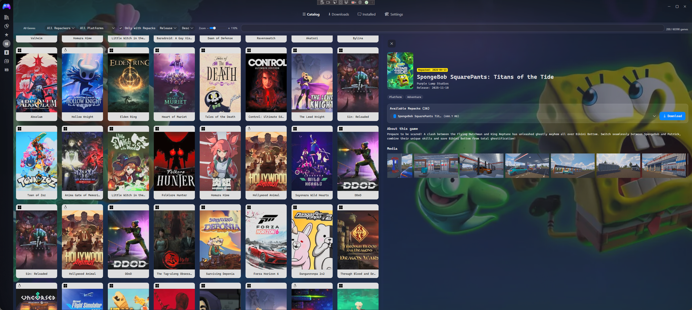

# GamesNexus (Playnite-Store ... still thinking of a name lol)

**GamesNexus** is a comprehensive, crowdsourced ecosystem for Playnite that bridges the gap between your game library and the world of game repacks and releases.

It consists of a blazing-fast Playnite extension, a high-performance caching API, and a robust Admin Panel for community-driven data curation.

_(Placeholder: Add a screenshot of the Playnite extension showing game details and downloads here)_

##  Features

- **In-Client Downloads:** Browse, discover, and download repacks directly inside Playnite.
- **Smart Matching:** Automatically links repacks from various sources to their official GameDB entries.
- **Blazing Fast API:** Node.js + Fastify + Redis backend ensuring instant search and data retrieval.
- **Community Curation:** A dedicated React-based Admin panel for moderating repacks, fixing metadata, and managing sources.

##  Repository Structure

| Component              | Path                           | Description                                                  | Tech Stack                |
| :--------------------- | :----------------------------- | :----------------------------------------------------------- | :------------------------ |
| **Playnite Extension** | `/playnite/playnite-extension` | The C# WPF Add-on that users install in Playnite.            | C#, WPF, .NET             |
| **Public API**         | `/api`                         | The read-only API serving data to the Playnite extension.    | Node.js, Fastify, Redis   |
| **Admin Panel UI**     | `/db/admin_panel/frontend`     | The dashboard for community moderators.                      | React, Vite, TailwindCSS  |
| **Admin API**          | `/db/admin_panel/backend`      | The read/write API for managing the database.                | Python, Flask, PostgreSQL |
| **ETL Scripts**        | `/db/scripts`                  | Python scripts for scraping, normalizing, and auditing data. | Python, Regex, Psycopg2   |

1. **Architecture & Master Plan:** Read [`docs/ARCHITECTURE_AND_PIPELINE.md`](./docs/ARCHITECTURE_AND_PIPELINE.md) to understand how the pieces fit together.
2. **Backend API:** Check out the [API Setup Guide (`/api/README.md`)](./api/README.md).
3. **Admin Panel:** Head over to the [Admin Panel Guide (`/db/admin_panel/README.md`)](./db/admin_panel/README.md).
4. **Playnite Extension:** Read the [Extension Dev Guide (`/playnite/playnite-extension/README.md`)](./playnite/playnite-extension/README.md).
5. **Python ETL Scripts:** Read the [Database Scripts Guide (`/db/scripts/README.md`)](./db/scripts/README.md).

##  Community & Data Moderation

GamesNexus relies on community curation to keep game metadata and repack links clean and organized. If you want to help us sort orphan repacks, assign genres, or submit new repack sources, check out our **[Community Pipeline Guide](./docs/ARCHITECTURE_AND_PIPELINE.md#community-data-pipeline)**.

_(Placeholder: Add a screenshot of the React Admin Panel showing the Repacks and Games explorer)_

##  License

This project is licensed under the MIT License. See the [LICENSE](LICENSE) file for details.
