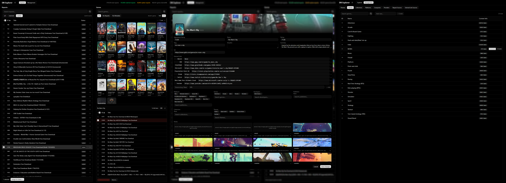

# 🛡️ GamesNexus Admin Panel

[← Back to Root README](../../README.md) | [Read Architecture](../../docs/ARCHITECTURE_AND_PIPELINE.md)

The Admin Panel is a unified dashboard for community moderators. It is used to curate the database, assign "orphan" repacks to official games, fix metadata, and manage repack sources.

It consists of two parts: a **React + Vite Frontend** and a **Python Flask Backend**.


_(Placeholder: Add screenshot of the Admin Panel UI)_

---

## 🖥️ Frontend (React / Vite)

The frontend is built with React, Vite, TailwindCSS v4, and Shadcn UI components.

### Setup & Run

1. Navigate to the frontend directory:
   ```bash
   cd frontend
   ```
2. Install dependencies:
   ```bash
   npm install
   ```
3. Start the development server:
   ```bash
   npm run dev
   ```
   _The UI will be available at `http://localhost:5173`._

_(Note: The frontend expects the backend API to be running on `http://localhost:5000/api`)_

---

## ⚙️ Backend (Python / Flask)

The backend provides the RESTful endpoints for the React UI to read and mutate the PostgreSQL database.

### Setup & Run

1. Navigate to the backend directory:
   ```bash
   cd backend
   ```
2. Create and activate a Python virtual environment:
   ```bash
   python -m venv venv
   source venv/bin/activate  # On Windows use: venv\Scripts\activate
   ```
3. Install dependencies:
   ```bash
   pip install flask flask-cors psycopg2-binary python-dotenv waitress
   ```
4. Create a `.env` file with your database credentials:
   ```env
   DB_DSN=host=localhost dbname=playnitedb user=postgres password=YOUR_PASSWORD
   FLASK_DEBUG=True
   ```
5. Run the server:
   ```bash
   python run.py
   ```
   _The backend will be available at `http://localhost:5000`._
