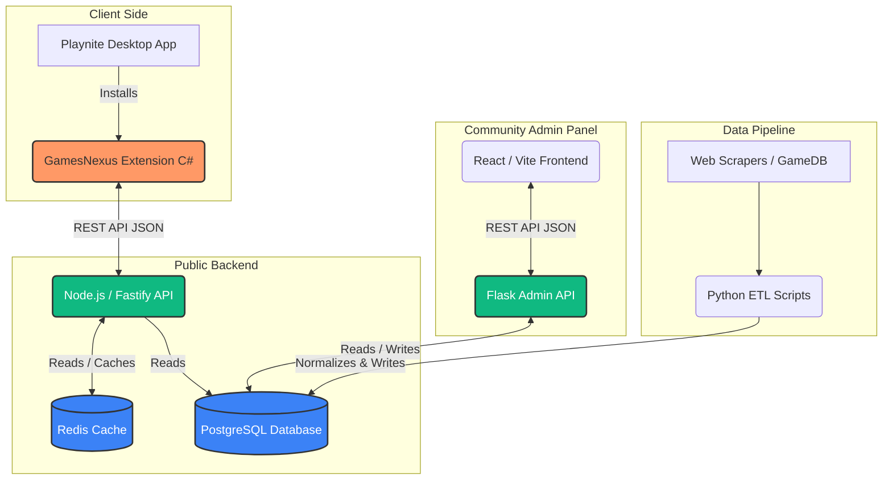

# Architecture, Hosting, and Community Pipeline

This document explains the infrastructure behind GamesNexus, how it is deployed in production, and how the community works together to maintain the database.

## 1. System Architecture

GamesNexus is a multi-tier architecture designed to separate the heavy, write-intensive curation work from the lightning-fast, read-heavy API used by Playnite clients.

- **Database (PostgreSQL):** The single source of truth. Stores normalized game metadata, repack URIs, platforms, and external links.
- **Cache (Redis):** Caches API payloads for 1-24 hours so the Playnite extension loads instantly without hitting Postgres.
- **Public API (Node.js/Fastify):** A highly scalable, read-only endpoint consumed by the Playnite extension.
- **Admin Panel (Flask/React):** A secured dashboard where moderators can perform CRUD operations on the database.



---

## 2. Hosting & Deployment Strategy

To run this project in production affordably and reliably, we recommend the following stack:

### A. Database (PostgreSQL & Redis)

- **PostgreSQL:** Host this on **[Supabase](https://supabase.com/)** or **[Neon.tech](https://neon.tech/)**. Both offer generous free tiers for open-source projects, connection pooling (crucial for Fastify), and easy backups.
- **Redis:** Host on **[Upstash](https://upstash.com/)**. It is a serverless Redis provider that charges per request with a massive free tier, perfect for caching API responses.

### B. Public API (Node.js)

- Host on **[Render](https://render.com/)** or **[Railway](https://railway.app/)**.
- Connect it to your hosted Postgres and Redis URLs via the `.env` variables (`DATABASE_URL` and `REDIS_URL`).
- Set auto-scaling if traffic from Playnite users spikes.

### C. Admin Panel (Flask + React)

- **Frontend (React):** Deploy for free on **[Vercel](https://vercel.com/)** or **Cloudflare Pages**. It just needs to be built with `npm run build`.
- **Backend (Flask):** Deploy alongside your Node API on **Render** or **Railway**.

_(Alternative: If you have a VPS like Hetzner or DigitalOcean, you can run all of these using `docker-compose` for ~$5/month)._

---

## 3. Playnite Extension Publishing Lifecycle

How do we get updates to the users?

### Step 1: Packing the Extension

Playnite extensions are packaged into `.pext` files using the Playnite Toolbox.

1. Download `Toolbox.exe` from the official Playnite repository.
2. Run `Toolbox.exe pack "path\to\playnite-extension" "path\to\output"`
3. This generates `GamesNexus.pext`.

### Step 2: GitHub Releases

1. Draft a new Release on GitHub (e.g., `v1.0.0`).
2. Upload the `GamesNexus.pext` file as an asset to the release.
3. Include a changelog.

### Step 3: Playnite Addon Database

To make the extension appear inside Playnite's built-in Add-on browser:

1. Fork the [Playnite/PlayniteAddonDatabase](https://github.com/JosefNemec/PlayniteAddonDatabase) repository.
2. Add/Update the `GamesNexus.yaml` manifest in their repository, pointing the download URL to your GitHub Release `.pext` file.
3. Submit a Pull Request. Once merged, all Playnite users will get an automatic update notification.

---

## 4. Community Data Pipeline (Crowdsourcing)

The magic of GamesNexus is how messy repack data is turned into clean game metadata. Here is the workflow we use to allow the community to help:

### The "Orphan" Problem

When our Python ETL scripts scrape repack sites, they often find titles like `[FitGirl] Cyberpunk 2077 v1.6 + All DLCs`. The script parses it, but sometimes it can't automatically link it to the official GameDB entry for `Cyberpunk 2077`. It becomes an **Orphan**.

### The Moderation Workflow

We use the **Admin Panel** to crowdsource the cleanup of orphans.

1. **Submission / Scraping:** Python scripts (`db/scripts/db_sync.py`) run daily. New repacks are added to the database.
2. **Triage:** Community Moderators log into the Admin Panel (`/db/admin_panel/frontend`).
   - They navigate to the **Explorer** tab.
   - They filter the Repacks list by `Status: Orphan`.
   - They search for the actual game in the "Games" panel.
   - _Action:_ Select the orphan repacks, click the target game, and press **"Assign to Game"**.

   ```mermaid
   sequenceDiagram
    participant Web as Scraper
    participant DB as PostgreSQL DB
    participant Mod as Community Moderator
    participant Admin as React Admin Panel

    Web->>DB: Inserts new parsed Repack
    DB-->>DB: Triggers Trigram Auto-Match
    alt Auto-Match Fails
        DB->>DB: Flags Repack as "Orphan"
    end

    Mod->>Admin: Opens "Orphan Repacks" View
    Admin->>DB: Fetch Orphans
    DB-->>Admin: Returns List

    Mod->>Admin: Selects Repack + Target Game
    Mod->>Admin: Clicks "Assign to Game"
    Admin->>DB: Updates game_repacks junction
    DB-->>Admin: Success
    Admin->>Mod: Shows Green Toast "Matched!"
   ```

3. **Game Creation:** If the game doesn't exist in our DB yet:
   - Moderators select the repacks and click **"Create New Game from Checked"**.
   - They input the official game name.
   - They use the **Game Edit Dialog** to add Cover URLs, Posters, external links (Steam, Epic), and assign Genres/Platforms.

4. **Reviewing Sources (Future Feature):**
   - Currently, sources are managed via the `Management` tab.
   - _Planned:_ A "Submissions" queue where regular users can submit a URL (e.g., a new Dodi repack link). Moderators will see this in the Admin Panel, click "Approve", and the ETL script will parse and add it to the DB.

### Adding Moderators

Currently, the Admin API is unprotected. Before opening the Admin Panel to the public, we will implement **Discord OAuth**.

- Users will log in via Discord.
- If they have the `@Curator` role in our Discord server, they will be granted access to the Admin Panel to modify junctions and game metadata.
